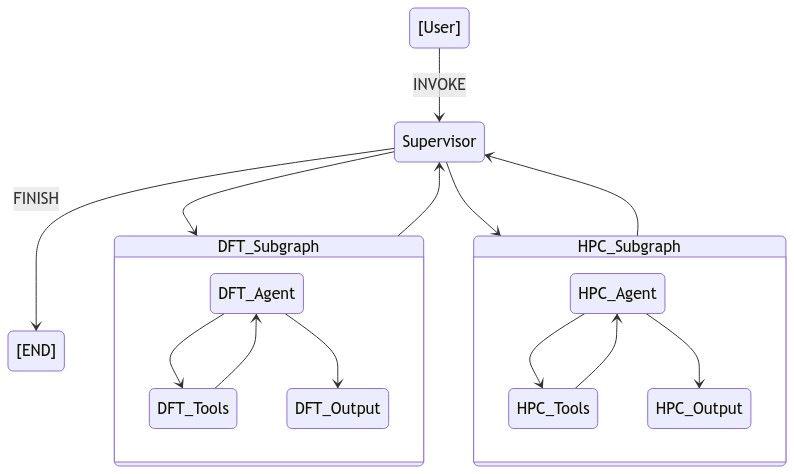

# Agent for scientific computattion

<div style="text-align: center;">
  
</div>


## Using Example
0. ```bash bin/invoke.sh``` if runnning on Artemis.
1. Set up model key in config/default.yaml
2. Edit working directory and pseudo_dir config/default.yaml
3. ```python invoke.py```

## Agent Prompt template(TODO)
## Tool prompt template(TODO)

## Developement Guide

1. Always check file exit