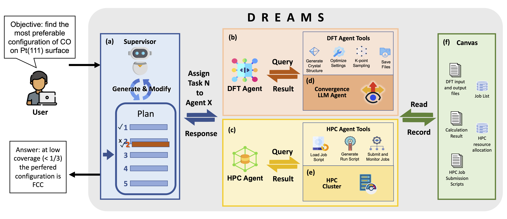
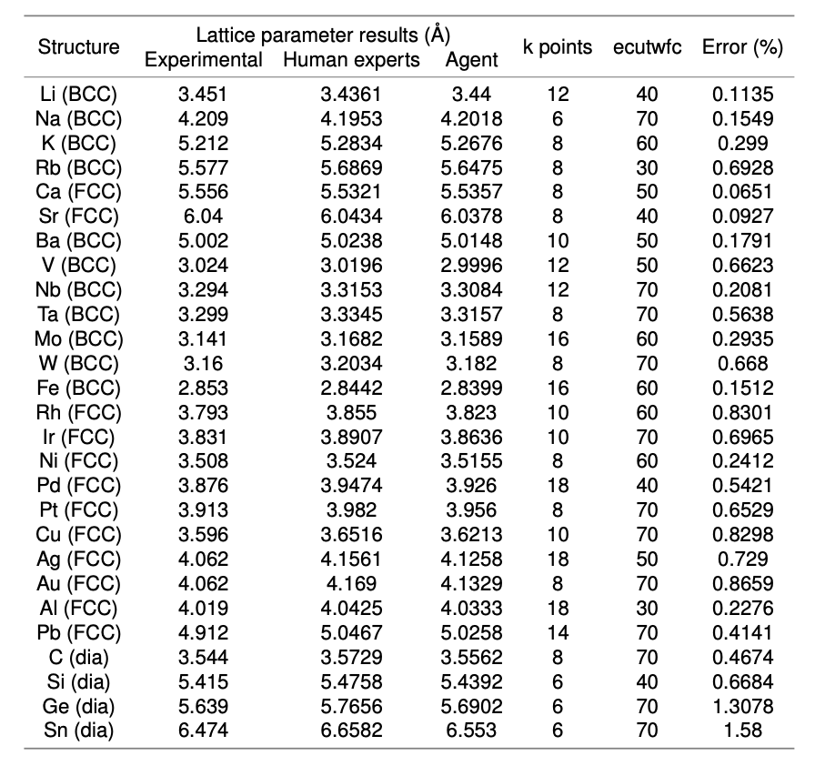
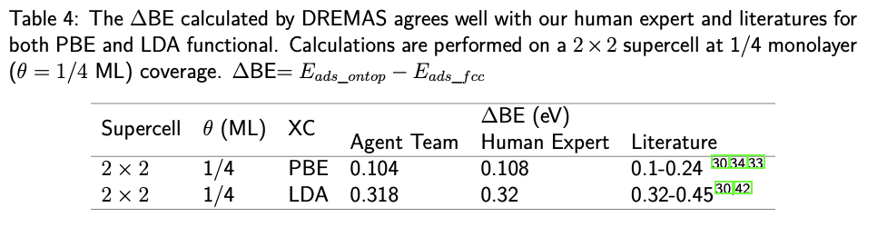
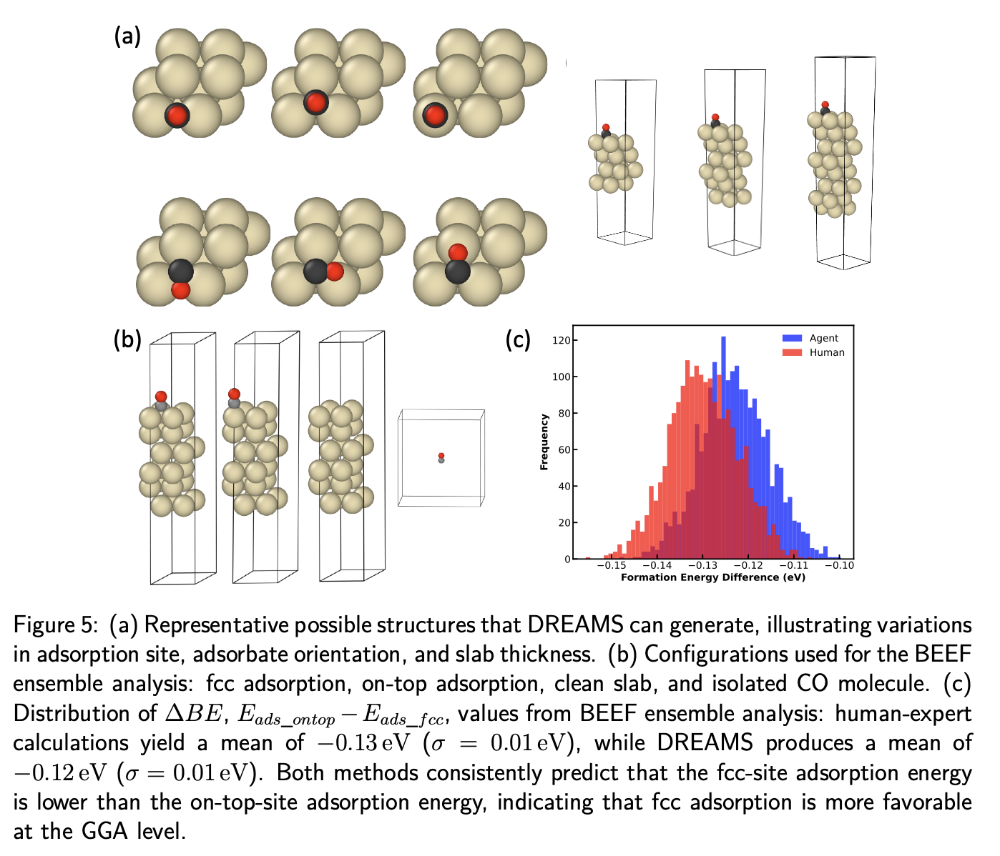

# DREAMS: Density Functional Theory Based Research Engine for Agentic Materials Simulation

[\[arxiv\]](https://arxiv.org/abs/2507.14267)  
## Overview



**DREAMS** (Density Functional Theory Based Research Engine for Agentic Materials Simulation) is a comprehensive framework designed to facilitate autonomous materials discovery and simulation workflows through artificial intelligence agents.

It uses ASE and Quantum ESPRESSO to perform DFT calculations and is built on top of the Langgraph with Claude 3.5 and Claude 3.7 to enable agentic capabilities.

## Sol27LC Benchmark Results
The following figure shows the performance of DREAMS on the Sol27LC benchmark, which includes 27 different materials systems. 



## CO/Pt Puzzle Results

The DREAMS framework has been tested on the CO/Pt puzzle, a well-known challenge in materials discovery that involves predicting the adsorption behavior of CO molecules on platinum surfaces. It has full capabilities to explore the potential configuration space. The following table shows the performance of DREAMS on the CO/Pt puzzle, which is a challenging test case for materials discovery.





## How to Use
1. Clone the repository:
   ```bash
   git clone https://github.com/BattModels/material_agent.git
   ```
2. Install the required dependencies: [autocat](https://aced-differentiate.github.io/auto_cat/), [langgraph](https://langchain-ai.github.io/langgraph/concepts/why-langgraph/), quantum-espresso and other dependencies.
3. Add your API keys to the `config/default.yaml` file. Change the pseudopotentials in the `config/default.yaml` and the working directory to the one you want to use.
4. Edit the usermessage in the `invoke.py` file to specify the task you want to perform.
5. Run the agent:
    ```bash
    python invoke.py
    ```
## Demo Video

<iframe src="https://drive.google.com/file/d/1XInq7Q226777BSsTfQSe5HptYrk_GOIE/preview" width="640" height="480" allow="autoplay"></iframe>

## References 
If you use DREAMS in your research, please cite the following paper:

```bibtex
@misc{wang2025dreamsdensityfunctionaltheory,
      title={DREAMS: Density Functional Theory Based Research Engine for Agentic Materials Simulation}, 
      author={Ziqi Wang and Hongshuo Huang and Hancheng Zhao and Changwen Xu and Shang Zhu and Jan Janssen and Venkatasubramanian Viswanathan},
      year={2025},
      eprint={2507.14267},
      archivePrefix={arXiv},
      primaryClass={cs.AI},
      url={https://arxiv.org/abs/2507.14267}, 
}
```

